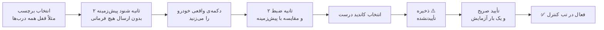

<div align="center">

# 🚗 CarTouch

**کنترل و مانیتورینگ خودرو با ESP32-S3 و CAN Bus — لمسی، وب، و یادگیرنده**


</div>

<div dir="rtl">

> [!WARNING]
> CarTouch روی **CAN Bus زنده‌ی خودرو** کار می‌کند. یک فرمان اشتباه می‌تواند رفتار غیرمنتظره‌ای در خودرو ایجاد کند.
> اول روی میز تست کار کنید، حالت **Listen-Only** را فعال نگه دارید تا مطمئن شوید، و فقط روی خودروی خودتان و با مسئولیت خودتان از آن استفاده کنید.

## 📑 فهرست

1. [معرفی](#-معرفی)
2. [وضعیت و محدودیت‌ها](#-وضعیت-و-محدودیتها)
3. [Learn Mode — یادگیری فرمان از خودرو](#-learn-mode--یادگیری-فرمان-از-خودرو)
4. [قطعات مورد نیاز](#-قطعات-مورد-نیاز)
5. [سیم‌بندی](#-سیمبندی)
6. [نصب و راه‌اندازی](#-نصب-و-راهاندازی)
7. [اولین اجرا](#-اولین-اجرا)
8. [ساختار پروژه](#-ساختار-پروژه)
9. [مستندات بیشتر](#-مستندات-بیشتر)

---

## ✨ معرفی

**CarTouch** یک دستگاه کوچک با **ESP32-S3** است که از طریق OBD-II یا مستقیم به CAN Bus خودرو وصل می‌شود و اطلاعات خودرو را نشان می‌دهد و (در صورت تأیید شما) فرمان‌هایی مثل قفل و شیشه را ارسال می‌کند.

| | قابلیت |
|---|---|
| 🎮 **کنترل** | صفحه‌ی لمسی TFT داخل خودرو (روش اصلی) + Web Dashboard از طریق WiFi (روش مکمل) |
| 🔐 **فرمان‌ها** | قفل/باز کردن ۴ درب و صندوق، ۴ شیشه + سانروف، آینه‌ها، دزدگیر |
| 📊 **مانیتورینگ** | سرعت، RPM، دمای موتور، ولتاژ باطری، سطح سوخت + خواندن کدهای خطا (DTC) — به‌صورت **غیرمسدودکننده** (نگاه کنید به وضعیت زیر) |
| 🎓 **یادگیری** | ضبط فرمان از دکمه‌های فیزیکی واقعی خودرو، یا ورود دستی CAN ID/بایت |
| ✅ **چرخه‌ی تأیید** | هر فرمان یادگرفته/دستی تا تأیید صریح شما «تأییدنشده» است و اجرا نمی‌شود |
| 💾 **دیتابیس شخصی** | ذخیره، بارگذاری و اشتراک‌گذاری پروفایل خودروهای دست‌ساز به‌صورت JSON |
| 🛡️ **ایمنی** | حالت Listen-Only (پیش‌فرض روشن)، محدودیت نرخ فرمان، اجبار تغییر رمز پیش‌فرض، Watchdog، توکن نشست WebSocket با همگام‌سازی بین TFT و وب |
| 🔋 **انرژی** | Auto Sleep بعد از ۱۰ دقیقه بی‌فعالیتی + بیدار شدن با پیام CAN |
| 🌗 **نمایش** | حالت شب/روز خودکار یا دستی + کالیبراسیون واقعی تاچ‌اسکرین |
| ⬆️ **به‌روزرسانی** | OTA (Over-The-Air) از طریق وب — بدون نیاز به اتصال کابل مجدد |

---

## 🧭 وضعیت و محدودیت‌ها

قبل از شروع بدانید چه چیزی آماده است و چه چیزی نه:

| موضوع | وضعیت |
|---|---|
| خواندن OBD-II استاندارد (RPM، سرعت، دما، …) | ✅ آماده — پیاده‌سازی **غیرمسدودکننده** (state machine در `OBD2Reader::update()`)؛ `loop()` اصلی هرگز روی پاسخ ECU مسدود نمی‌شود |
| Task Watchdog | ✅ فعال (پیش‌فرض ۸ ثانیه) — در صورت گیر کردن هر بخشی از `loop()`، دستگاه به‌جای هنگ دائمی ری‌ست می‌شود |
| Learn Mode و ورود دستی | ✅ پیاده‌سازی شده — روی خودروهای دارای **rolling code** (معمولاً بعد از ۲۰۱۸ و برندهای پریمیوم) کار نمی‌کند |
| فرمان قفل/شیشه از روی فایل DBC | ❌ **پشتیبانی نمی‌شود.** فایل‌های OpenDBC عمدتاً «خواندنی» هستند؛ برای فرمان از Learn Mode یا ورود دستی استفاده کنید |
| فایل‌های DBC | ۵۷ فایل همراه پروژه است؛ **۳۸ مدل** (تویوتا، بی‌ام‌و، هوندا/اکورا، جی‌ام/کادیلاک، کرایسلر/FCA، فورد، هیوندای، مزدا، مرسدس، نیسان، اوپل، PSA، ولوو، فولکس‌واگن، تسلا، ریویان و چند برند دیگر) + حالت عمومی OBD-II در لیست انتخاب وصل شده‌اند. فهرست کامل مدل‌های وصل‌نشده و دلیل هرکدام در کامنت‌های ابتدای `VehicleDB::begin()` (`src/vehicle_db.cpp`) مستند است |
| پارسر DBC | سیگنال‌های **Intel (`@1`) و Motorola (`@0`) هر دو پشتیبانی می‌شوند** (نگاشت بیت جداگانه برای هرکدام). سقف **۱۵۰ پیام** برای هر فایل (چند فایل بسیار حجیم مثل `ford_lincoln_base_pt.dbc` هنوز به‌عمد به لیست وصل نشده‌اند — به همان کامنت بالا مراجعه کنید) |
| Listen-Only | پیش‌فرض **روشن** است (`listenOnlyMode = true`). این حالت فقط **نرم‌افزاری** است (فیلتر سطح برنامه، نه enforcement سخت‌افزاری واقعی درایور TWAI) |
| کالیبراسیون تاچ | ✅ کالیبراسیون **واقعی و تعاملی** (۵ نقطه، با `TFT_eSPI::calibrateTouch()`) در اولین بوت اجرا می‌شود و نتیجه در حافظه‌ی غیرفرار ذخیره می‌شود؛ از تب تنظیمات هم قابل تکرار است |
| Session وب/TFT | ✅ تغییر رمز از هر مسیری (صفحه‌ی لمسی یا وب) بلافاصله تمام نشست‌های وب (HTTP و WebSocket) را باطل می‌کند |
| OTA (به‌روزرسانی بی‌سیم) | ✅ پیاده‌سازی شده — مسیر `/update` در وب‌سرور، آپلود فایل `.bin` فریمویر یا ایمیج SPIFFS |
| حافظه‌ی داخلی (DRAM) | آبجکت‌های حجیم (`vehicleDB` و وابسته‌هایش) به‌صورت **پوینتر با `new` در `setup()`** ساخته می‌شوند تا از سرریز DRAM هنگام لینک جلوگیری شود؛ روی هسته‌های Arduino-ESP32 با PSRAM فعال، تخصیص‌های بزرگ به‌طور خودکار از PSRAM سرو می‌شوند |
| HTTPS | ندارد — ترافیک وب رمزنگاری نمی‌شود |
| Secure Boot / Flash Encryption | ندارد |
| تست روی سخت‌افزار واقعی | تغییرات اخیر (لیست بالا) به‌صورت منطقی/دستی بررسی شده‌اند، ولی هنوز با toolchain واقعی PlatformIO کامپایل و روی خودروی واقعی تست نشده‌اند |

> کارکرد نهایی روی خودروی واقعی فقط با تست خودتان روی سخت‌افزار قابل تأیید است.
> فهرست کامل و به‌روز مشکلات شناخته‌شده: [`CHANGELOG.md`](./CHANGELOG.md)
> وضعیت گام‌به‌گام اصلاحات نسخه‌ی تجاری: [`PROGRESS_CHECKLIST.md`](./PROGRESS_CHECKLIST.md)

---

## 🎓 Learn Mode — یادگیری فرمان از خودرو

هر خودرو فرمان‌های کنترلی مخصوص خودش را دارد که در هیچ دیتابیس عمومی نیست. Learn Mode با شنود امن این مشکل را حل می‌کند:



1. دستگاه را به CAN Bus وصل کنید (بخش [سیم‌بندی](#-سیمبندی)).
2. از تب «یادگیری» (روی TFT یا وب) یک برچسب فرمان انتخاب کنید.
3. دستگاه ۲ ثانیه پیام‌های پیش‌زمینه را می‌شنود — **بدون ارسال هیچ فرمانی**.
4. دکمه‌ی فیزیکی خودرو را بزنید؛ دستگاه ۲ ثانیه بعدی را ضبط می‌کند.
5. از میان کاندیدهای یافت‌شده، درست را انتخاب کنید.
6. فرمان با وضعیت «تأییدنشده» (⚠️) ذخیره می‌شود و **قابل اجرا نیست**.
7. با یک تأیید جداگانه (که CAN ID و بایت‌های واقعی را نشان می‌دهد) آن را یک‌بار آزمایش و نتیجه را دستی تأیید می‌کنید.
8. فقط بعد از این مرحله، فرمان در تب کنترل اصلی فعال می‌شود.

> تشخیص کاندیدها نیمه‌خودکار است و تأیید نهایی همیشه با شماست. دستگاه هرگز فرمان آزمایشی یا تصادفی روی باس نمی‌فرستد.
> معماری، الگوریتم و قوانین ایمنی: [`CarTouch_SPEC.md`](./CarTouch_SPEC.md)

---

## 🔩 قطعات مورد نیاز

| قطعه | تعداد | توضیحات |
|---|:---:|---|
| **ESP32-S3 DevKit** (ماژول N16R8) | ۱ | فلش ۱۶MB + PSRAM هشت مگابایتی؛ دارای کنترلر CAN (TWAI) |
| **SN65HVD230** | ۱ | ترنسیور CAN ۳٫۳ ولت |
| **نمایشگر TFT با کنترلر ILI9341** | ۱ | SPI، رزولوشن ۲۴۰×۳۲۰، ۲٫۴ تا ۲٫۸ اینچ، همراه تاچ XPT2046 (روی همان ماژول) |
| **مبدل 12V به 3.3V** | ۱ | حداقل ۱ آمپر خروجی |
| **کابل / کانکتور OBD-II** | ۱ | اختیاری (اگر مستقیم به سیم‌های CAN وصل نمی‌شوید) |
| سیم jumper و محفظه | — | برای اتصال و نصب داخل خودرو |

> [!IMPORTANT]
> پروژه برای پنل **ILI9341** تنظیم شده است (`-DILI9341_DRIVER=1` در `platformio.ini`). اگر پنل شما ST7796 (یا کنترلر دیگری) است، درایور را در `platformio.ini` عوض کنید و ابعاد رابط کاربری را هم با آن تطبیق دهید — این دو کنترلر با هم سازگار نیستند.

---

## 🔌 سیم‌بندی

<details open>
<summary><b>نمایشگر TFT و تاچ ← ESP32-S3</b></summary>

| پین ماژول | پین ESP32-S3 | توضیحات |
|---|---|---|
| CS | GPIO10 | Chip Select |
| DC | GPIO7 | Data/Command |
| RST | GPIO4 | Reset |
| MOSI | GPIO11 | SPI Data In |
| SCLK | GPIO12 | SPI Clock |
| MISO | GPIO13 | SPI Data Out |
| BL | GPIO21 | Backlight (PWM) |
| T_CS | GPIO14 | Touch Chip Select |
| T_DIN / T_DOUT / T_CLK | GPIO11 / GPIO13 / GPIO12 | اشتراکی با SPI نمایشگر (فقط CS تاچ جداست) |
| VCC / GND | 3.3V / GND | تغذیه و زمین مشترک |

</details>

<details open>
<summary><b>ماژول CAN (SN65HVD230) ← ESP32-S3</b></summary>

| پین ماژول | پین ESP32-S3 | توضیحات |
|---|---|---|
| VCC / GND | 3.3V / GND | تغذیه و زمین مشترک |
| CTX | GPIO9 | CAN Transmit |
| CRX | GPIO6 | CAN Receive (به‌جای GPIO10 تا با TFT_CS تداخل نکند) |

> باس خودرو از قبل ترمینیت (۱۲۰Ω) شده است؛ مقاومت ترمینیشن ماژول را فعال **نکنید** (فقط روی میز تست دو-نودی لازم است).

</details>

<details open>
<summary><b>اتصال به CAN Bus خودرو</b></summary>

**روش اول — از طریق OBD-II (توصیه‌شده):**

| پین OBD-II | علامت | اتصال |
|:---:|---|---|
| 6 | CAN-H | CAN-H ماژول SN65HVD230 |
| 14 | CAN-L | CAN-L ماژول SN65HVD230 |
| 4 | GND | زمین |
| 16 | +12V | ورودی مبدل ولتاژ (تغذیه) |

پورت OBD-II معمولاً زیر فرمان یا کنار جعبه‌فیوز است. پین ۱۶ همیشه برق دارد؛ Auto Sleep برای همین در نظر گرفته شده است.

**روش دوم — اتصال مستقیم به سیم‌های CAN (فقط برای متخصصان):** رنگ سیم‌های CAN بین خودروها فرق می‌کند؛ حتماً از نقشه‌ی سیم‌کشی همان مدل استفاده کنید.

> [!CAUTION]
> قبل از قطع یا لحیم‌کاری روی سیم‌ها باتری خودرو را جدا کنید. جابه‌جا وصل کردن CAN-H و CAN-L می‌تواند به ماژول آسیب بزند.

</details>

<details>
<summary><b>تغذیه از 12V خودرو</b></summary>

مبدل باید حداقل **۱ آمپر** جریان خروجی 3.3V داشته باشد (نمایشگر و بک‌لایت مصرف قابل‌توجهی دارند).

</details>

---

## 🚀 نصب و راه‌اندازی

**پیش‌نیازها:** [VS Code](https://code.visualstudio.com/) + افزونه‌ی PlatformIO + Git

```bash
git clone https://github.com/bosssplus/CarTouch.git
cd CarTouch

pio run -t upload      # کامپایل و آپلود فریمویر
pio run -t uploadfs    # آپلود فایل‌های وب و DBC به SPIFFS
pio device monitor     # مانیتور سریال (115200)
```

> [!NOTE]
> پوشه‌ی `data/` حدود **۳٫۵ مگابایت** است. جدول پارتیشن پروژه (`default_16MB.csv`) برای این حجم روی فلش ۱۶ مگابایتی طراحی شده. اگر `uploadfs` خطای «حجم بیش‌ازحد» داد، DBC های غیرضروری را از `data/dbc/` حذف کنید (فقط فایل‌های وایرشده در `VehicleDB::begin()` — نگاه کنید به `src/vehicle_db.cpp` — واقعاً لازم‌اند) یا جدول پارتیشن را با فضای SPIFFS بزرگ‌تر تعریف کنید.

> [!NOTE]
> ⚠️ **وضعیت کامپایل:** آخرین دور اصلاحات (بازنویسی OBD2Reader، پارسر DBC، مدیریت حافظه‌ی `vehicleDB`) به‌صورت دستی/منطقی بررسی شده، اما با toolchain واقعی PlatformIO کامپایل نشده است. قبل از فلش روی سخت‌افزار واقعی، حتماً یک‌بار `pio run` را خودتان اجرا کنید.

**بیلد خودکار:** فایل `.github/workflows/CarTouch-build.yml` با هر push و Pull Request فریمویر و ایمیج SPIFFS را می‌سازد و فایل‌های `.bin` را ۳۰ روز به‌عنوان Artifact نگه می‌دارد.

<details>
<summary><b>کتابخانه‌ها (خودکار توسط PlatformIO نصب می‌شوند)</b></summary>

| کتابخانه | نسخه | مجوز | کاربرد |
|---|---|---|---|
| TFT_eSPI | ≥ 2.5.43 | BSD | درایور نمایشگر + کالیبراسیون تاچ |
| lvgl | 8.4.x | MIT | رابط گرافیکی |
| ESPAsyncWebServer | ≥ 3.7.0 | LGPL | وب سرور Async + OTA |
| AsyncTCP | ≥ 3.3.0 | LGPL | TCP Async |
| ArduinoJson | ≥ 7.2.0 | MIT | کار با JSON |

</details>

---

## 🔑 اولین اجرا

1. دستگاه را روشن کنید و به WiFi با نام **`CarTouch`** وصل شوید (رمز موقت: `12345678`).
2. در همین اولین بوت، اگر تاچ‌اسکرین قبلاً کالیبره نشده باشد، یک ویزارد کالیبراسیون ۵-نقطه‌ای روی صفحه ظاهر می‌شود — نقاط چشمک‌زن را لمس کنید.
3. در مرورگر آدرسی که در Serial Monitor چاپ می‌شود را باز کنید (معمولاً `192.168.4.1`).
4. با نام کاربری `admin` و رمز موقت `cartouch` وارد شوید.
5. **همین اول رمز را عوض کنید** (حداقل ۸ کاراکتر، متفاوت از رمز پیش‌فرض) — از تب تنظیمات وب یا از صفحه‌ی لمسی. تا تغییر ندهید، دستگاه هر بار هشدار نشان می‌دهد. تغییر رمز از هر مسیر (وب یا لمسی)، بلافاصله نشست‌های باز در مسیر دیگر را هم باطل می‌کند.

> رمزهای موقت در ریپوی عمومی دیده می‌شوند؛ آن‌ها را رمز نهایی حساب نکنید. رمز WiFi دستگاه (Access Point) را می‌توانید قبل از فلش با `WIFI_AP_PASSWORD` در `src/config.h` عوض کنید.

پیام‌های WebSocket روی همان پورت ۸۰ (مسیر `/ws`) و بعد از احراز هویت با توکن نشست کار می‌کنند.

---

## 📂 ساختار پروژه

<div dir="ltr">

```
CarTouch/
├── platformio.ini                # تنظیمات PlatformIO، پین‌ها و کتابخانه‌ها
├── README.md                     # همین فایل
├── CHANGELOG.md                  # تاریخچه تغییرات + مشکلات شناخته‌شده
├── CarTouch_SPEC.md              # مشخصات فنی کامل v2.0 (مرجع توسعه)
├── PROGRESS_CHECKLIST.md         # وضعیت گام‌به‌گام اصلاحات نسخه‌ی تجاری
├── .github/workflows/            # بیلد خودکار در GitHub Actions
├── src/
│   ├── main.cpp                  # setup + loop
│   ├── config.cpp/.h             # پین‌ها، ثابت‌ها، تنظیمات، کالیبراسیون تاچ
│   ├── can_manager.cpp/.h        # مدیریت CAN (TWAI)
│   ├── obd2_reader.cpp/.h        # خواندن OBD-II (غیرمسدودکننده)
│   ├── vehicle_control.cpp/.h    # اجرای فرمان‌ها (از ActiveProfileManager)
│   ├── vehicle_db.cpp/.h         # پارسر DBC (Intel + Motorola)
│   ├── tft_ui.cpp/.h             # رابط لمسی LVGL — ۴ تب + کالیبراسیون تاچ
│   ├── webserver.cpp/.h          # وب سرور + WebSocket + OTA
│   ├── wifi_manager.cpp/.h       # WiFi (AP/STA)
│   ├── custom_vehicle.h          # ساختار پروفایل‌های سفارشی
│   ├── custom_vehicle_store.*    # ذخیره JSON در SPIFFS
│   ├── learn_engine.*            # موتور یادگیری (capture/diff)
│   └── active_profile_manager.*  # یکپارچه‌ساز DBC + سفارشی
└── data/                         # محتوای SPIFFS
    ├── index.html, style.css, app.js   # وب (۴ تب: کنترل/داشبورد/یادگیری/تنظیمات)
    ├── dbc/                            # ۵۷ فایل DBC از OpenDBC (۳۸ مدل وصل‌شده)
    └── custom_vehicles/                # در زمان اجرا ساخته می‌شود (نه در ریپو)
```

</div>

---

## 📚 مستندات بیشتر

| فایل | چه چیزی در آن هست |
|---|---|
| [`CarTouch_SPEC.md`](./CarTouch_SPEC.md) | معماری Learn Mode، الگوریتم، قوانین ایمنی، ترتیب توسعه — مرجع کامل برای ادامه‌ی توسعه |
| [`CHANGELOG.md`](./CHANGELOG.md) | تغییرات هر نسخه، اصلاحات امنیتی و باگ‌ها، و مشکلات شناخته‌شده |
| [`PROGRESS_CHECKLIST.md`](./PROGRESS_CHECKLIST.md) | وضعیت دقیق هر مورد از چک‌لیست اصلاحات نسخه‌ی تجاری (کامل‌شده / باقی‌مانده) |

**مجوز:** MIT

</div>
